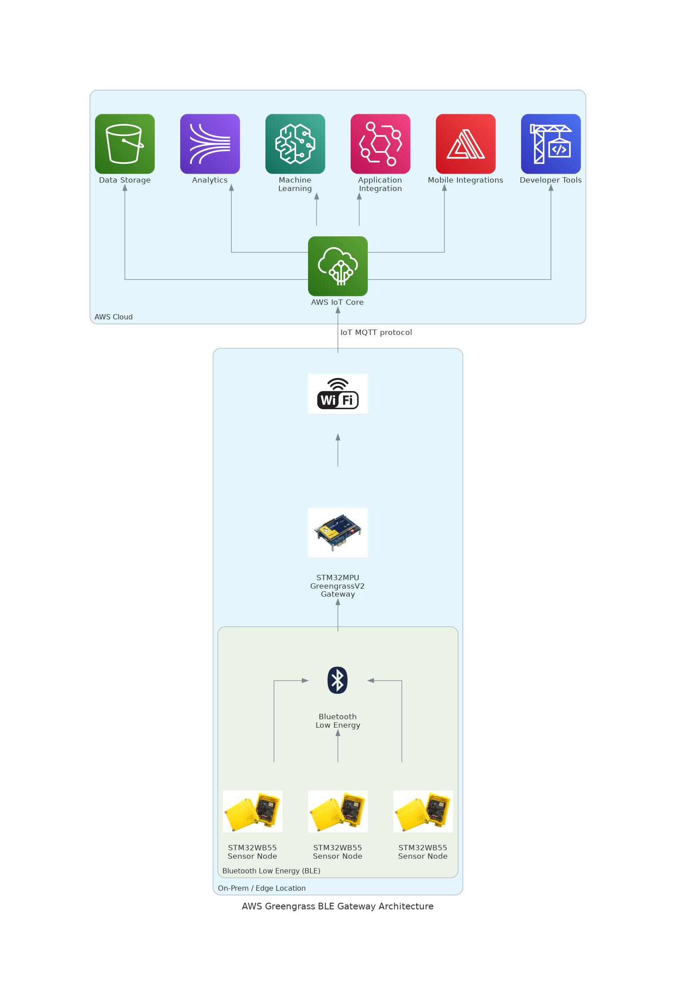
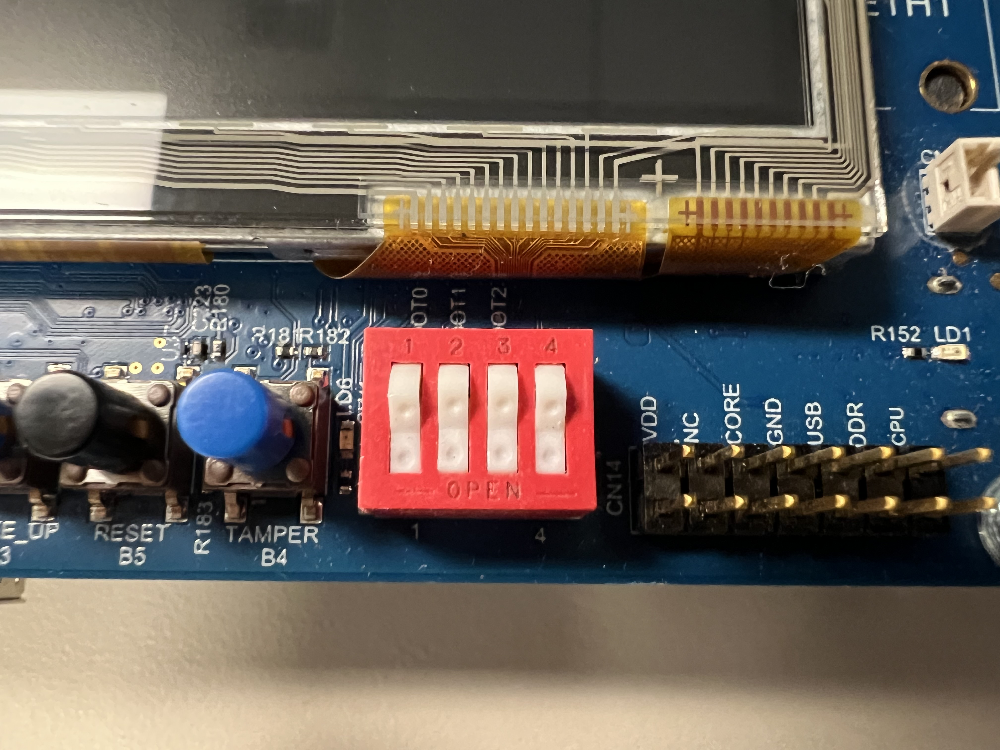
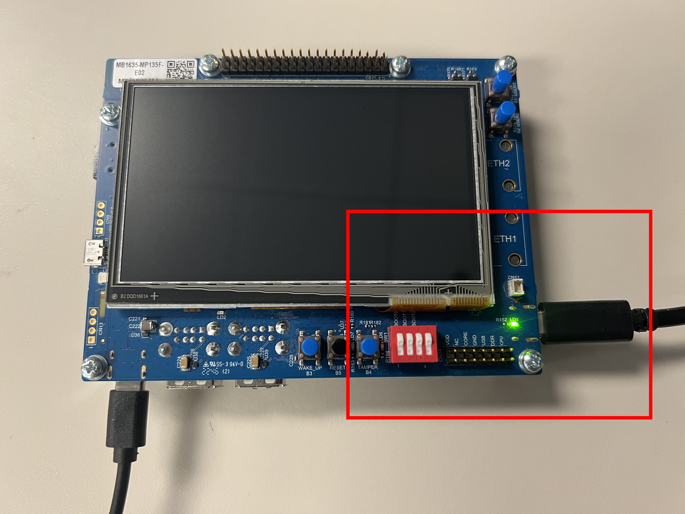
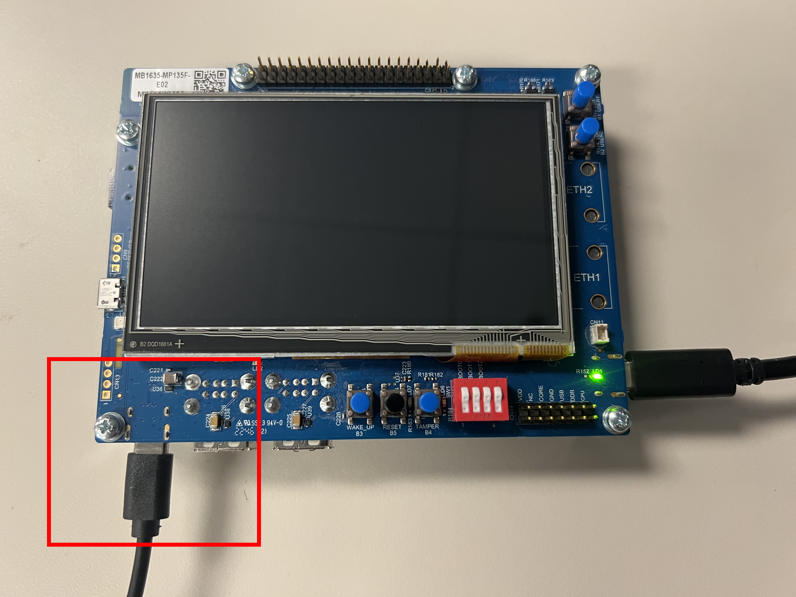
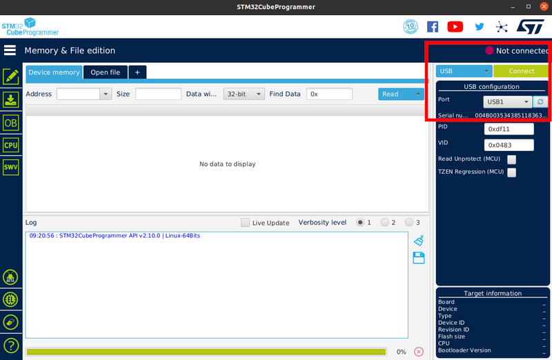
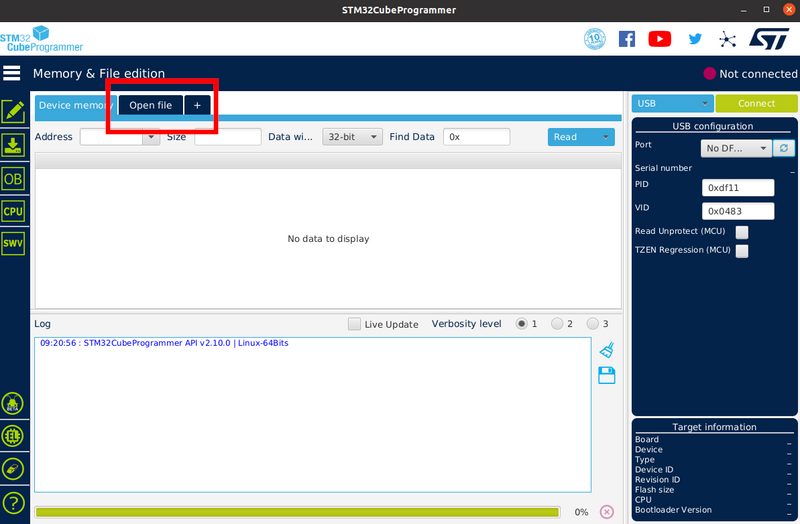
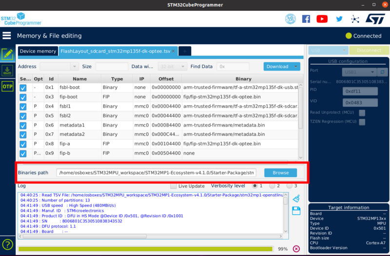
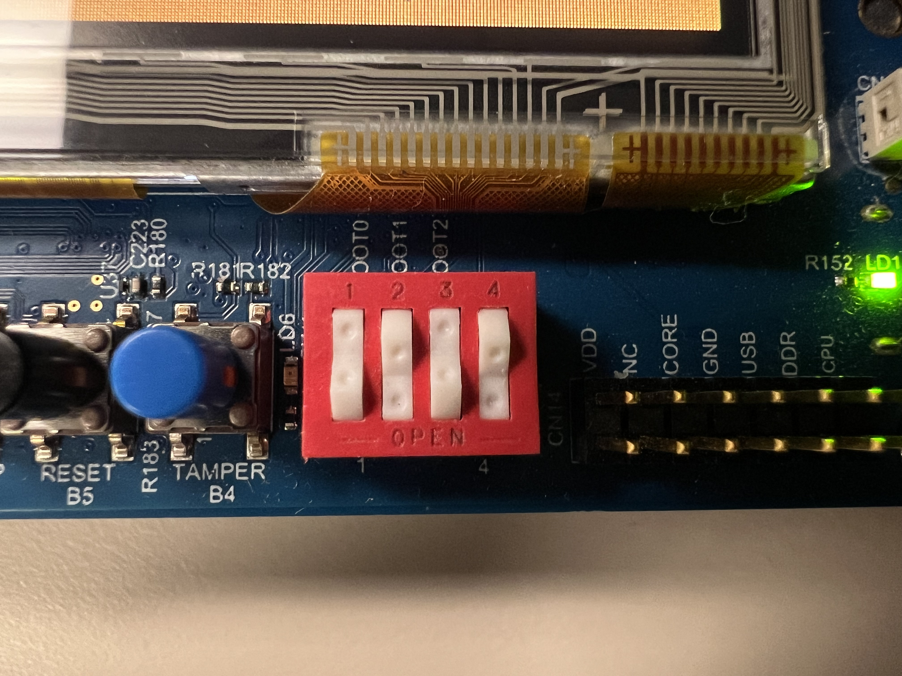
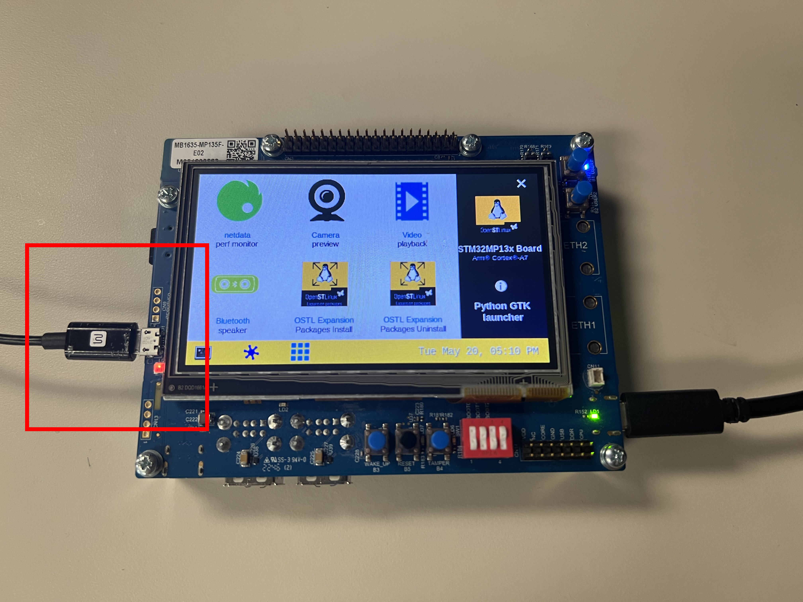
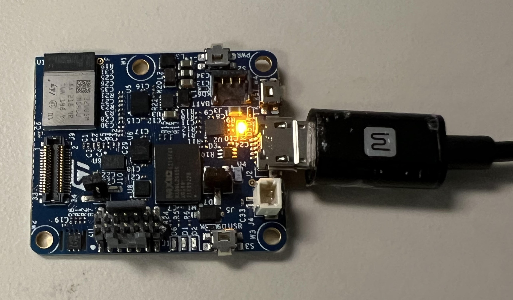

# Workshop: Getting Started with AWS Greengrass Lite on STM32MP1

This workshop walks you through configuring the [**STM32MP135F-DK**](https://www.st.com/en/evaluation-tools/stm32mp135f-dk.html) board as a **BLE-to-AWS IoT Gateway** using [**AWS IoT Greengrass Lite**](https://docs.aws.amazon.com/greengrass/v2/developerguide/greengrass-nucleus-lite-component.html). In this setup, the MP1 board bridges data from **Bluetooth Low Energy (BLE) sensor nodes**—such as the [**STEVAL-PROTEUS1**](https://www.st.com/en/evaluation-tools/steval-proteus1.html) – Bluetooth LE sensor node—to the cloud via an [**AWS IoT Greengrass V2 Component Deployment**](https://docs.aws.amazon.com/greengrass/v2/developerguide/manage-deployments.html): 



---

## Introduction

In this hands-on guide, you'll configure your **STM32MP135F-DK** as a BLE gateway that collects sensor data from the **STEVAL-PROTEUS1** industrial BLE node and transmits it to the cloud via **AWS IoT Greengrass Lite**.

This demo showcases how **AWS IoT Greengrass Lite** enables lightweight, cloud-connected edge computing on **cost-effective embedded platforms**. Greengrass Lite supports:

* Local data processing
* Secure AWS IoT Core connectivity
* Simple over-the-air (OTA) deployments and updates
* Seamless integration with AWS services for analytics, storage, and alerting
* Basic device health monitoring and lifecycle management

Paired with **STM32MP1**, this solution highlights a scalable, low-power, and production-ready option for IoT gateways. The **STM32MP135F-DK** delivers:

* Single-core Arm® Cortex®-A7 performance for Linux + BLE gateway workloads
* Certified security features suited for industrial applications
* Low energy consumption and reduced system cost
* Support for OpenSTLinux and STM32Cube development tools
* A rich ecosystem and long-term support from ST and its partners

Together, **Greengrass Lite** and the **STM32MP1** form a powerful combination for developers seeking to build cost-effective, secure, connected, and maintainable edge-to-cloud IoT systems.

### What You'll Accomplish

By following this guide, you will:

* Flash the **STM32MP135F-DK** with a OpenSTLinux starter image that includes required dependencies.
* Connect the board to Wi-Fi for cloud access.
* Install and configure **AWS IoT Greengrass Lite** on the board.
* Deploy a custom **BLE Gateway Python component** to interface with the **STEVAL-PROTEUS1**.
* Stream live BLE sensor data to the cloud.

### High-Level Workflow

1. [**Flash the MP1**](#flashing-the-starter-package): Install the OpenSTLinux starter image using STM32CubeProgrammer.
2. [**Connect the MP1 to Wi-Fi**](#setup-the-wlan-connection): Enable internet access for AWS services.
3. [**Install Greengrass Lite on MP1**](#install-aws-iot-greengrass-lite): Provision the device as a Greengrass core.
4. [**Deploy BLE Gateway Comonent to MP1**](#deploy-ble-gateway): Push a BLE data collection component to Greengrass.

---

## Hardware Requirements

You'll need the following hardware components:

- USB-A to USB-C data cable
- USB-C power cable
- USB-A to Micro-USB cable
- [STEVAL-PROTEUS1](https://www.st.com/en/evaluation-tools/steval-proteus1.html) – Bluetooth LE sensor node
- [STM32MP135F-DK](https://www.st.com/en/evaluation-tools/stm32mp135f-dk.html) – MPU development board

---

## Software Prerequisites

Make sure you install or have access to the following:

- [STM32CubeProgrammer](https://www.st.com/en/development-tools/stm32cubeprog.html) – for flashing the board
- [STM32MP1 Starter Package Image](https://www.st.com/en/embedded-software/stm32mp1starter.html#get-software)  – a pre-built Linux distribution from STMicroelectronics for STM32MP1 boards
- [Git Bash](https://git-scm.com/downloads) – for running shell scripts on Windows
- [AWS Account](https://aws.amazon.com/free) – required to provision IoT devices and Greengrass components
- [AWS CLI](https://docs.aws.amazon.com/cli/latest/userguide/getting-started-install.html) – for managing AWS resources via the command line

---

## Git Submodules

You will need to clone the following repositories as submodules with this command:

```bash
git clone https://github.com/stm32-hotspot/GreengrassLite_STM32MP1_Workshop.git --recurse-submodules
```

> If you've already cloned without submodules, you can initialize them manually with:

```bash
git submodule update --init --recursive
```


### Greengrass Lite Setup Repository

> Contains provisioning scripts and component configurations for setting up Greengrass Lite on the STM32MP1 board.

* GitHub:
  [https://github.com/stm32-hotspot/STM32MP1\_AWS-IoT-Greengrass-nucleus-lite.git](https://github.com/stm32-hotspot/STM32MP1_AWS-IoT-Greengrass-nucleus-lite.git)


### BLE Gateway Setup Repository

> Contains scripts and configuration files for deploying BLE functionality using the STEVAL-PROTEUS1 with AWS IoT Greengrass.

* GitHub:
  [https://github.com/stm32-hotspot/GreenGrass\_Lite\_BLE\_Gateway\_Proteus](https://github.com/stm32-hotspot/GreenGrass_Lite_BLE_Gateway_Proteus)


---

## Instructions

Before getting started, make sure the following setup steps are complete:

* All [software prerequisites](#software-prerequisites) are installed on your development machine.
* All [submodules](#git-submodules) are cloned  using `--recurse-submodules`.
* The [STM32MP1 Starter Package Image](https://www.st.com/en/embedded-software/stm32mp1starter.html#get-software) is downloaded and extracted to an accessible location.
* [AWS CLI](https://docs.aws.amazon.com/cli/latest/userguide/getting-started-install.html) is installed and [setup](https://docs.aws.amazon.com/cli/latest/userguide/cli-chap-getting-started.html) for programatic access with the [`aws configure`](https://docs.aws.amazon.com/cli/latest/userguide/getting-started-quickstart.html#getting-started-quickstart-new) command on your development PC. 

---

### Flashing the Starter Package

This section guides you through installing the necessary drivers and flashing the [STM32MP1 Starter Package Image](https://www.st.com/en/embedded-software/stm32mp1starter.html#get-software) onto the STM32MP135F-DK using USB (DFU mode).

> For background information, diagrams, and additional support, refer to the official [STM32MP135x-DK Boot Image Setup Guide](https://wiki.st.com/stm32mpu/wiki/Getting_started/STM32MP1_boards/STM32MP135x-DK/Let%27s_start/Populate_the_target_and_boot_the_image).


#### Step 1: Install STM32CubeProgrammer Dependencies

##### On Linux

Install required USB packages and copy udev rules:

```bash
sudo apt-get install libusb-1.0-0
cd <STM32CubeProgrammer_Install_Path>/Drivers/rules
sudo cp *.* /etc/udev/rules.d/
```

This ensures your PC can detect and communicate with the board over USB.

##### On Windows

Run the DFU driver installer:

```powershell
cd <STM32CubeProgrammer_Install_Path>\Drivers\DFU_Driver\
.\STM32Bootloader.bat
```

If you encounter issues, refer to the troubleshooting guide:
[DFU Driver Installation Troubleshooting (ST Wiki)](https://wiki.st.com/stm32mpu/wiki/STM32CubeProgrammer#How_to_proceed_when_the_DFU_driver_installation_fails_on_Windows_host_PC)

#### Step 2: Flash the Image

1. **Set boot switches** to DFU mode:
   `1-Open 2-Open 3-Open 4-Open`
   
   

2. **Connect power** using a USB-C cable to the `PWR CN12` port.
   
   

3. **Connect data** using a USB-A to USB-C cable from your PC to the `CN7/USB_OTG` port.
   
   

4. Launch **STM32CubeProgrammer**.

5. In the GUI, select **USB** mode and connect to the board.
   
   

6. Click **Open File** and select:
   `FlashLayout_sdcard_stm32mp135x-dk-optee.tsv`
   
   

7. Set the **Binaries Path** to:
   `$[Starter_Pack_Path]/images/stm32mp1`
   
   

8. Click **Download** to begin flashing.

9. After flashing completes:

   * **Update boot switches** to boot from SD card:
     `1-Closed 2-Open 3-Closed 4-Open`
     
     

   * **Power-cycle** the board.

---

### Setup the WLAN Connection

This step sets up Wi-Fi connectivity on the STM32MP135-DK using its onboard WLAN interface.

> For background information, diagrams, and support resources, visit the [How to setup a WLAN connection](https://wiki.st.com/stm32mpu/wiki/How_to_setup_a_WLAN_connection)


#### WLAN Setup Summary

1. **Connect the Board**
   With power to the board, connect a `USB-A to Micro-USB` cable from your development PC to the STM32MP135-DK's `CN10/USB_STLINK` Micro-USB port.

   

2. **Update the Wi-Fi Credentials**
   Depending on your **host operating system**, open the appropriate script ([configureWifi.sh](./configureWifi.sh) or [configureWifi.ps1](./configureWifi.ps1)) in a text editor and update the **SSID** and **PASSWORD** fields:

   * **Linux/macOS**: edit [`configureWifi.sh`](./configureWifi.sh)

     ```sh
     # === USER CONFIGURATION ===
     SSID="YOUR_WIFI_SSID"
     PASSWORD="YOUR_WIFI_PASSWORD"
     ```
   * **Windows (PowerShell)**: edit [`configureWifi.ps1`](./configureWifi.ps1)

     ```powershell
     # USER CONFIGURATION
     $SSID = "YOUR_WIFI_SSID"
     $PASSWORD = "YOUR_WIFI_PASSWORD"
     ```

3. **Run the Script from Your Development PC**
   Use the terminal appropriate for your operating system:

   * **Linux/macOS (Bash)**:

     ```bash
     chmod +x configureWifi.sh
     sudo ./configureWifi.sh
     ```

   * **Windows (PowerShell)**:

     ```powershell
     .\configureWifi.ps1
     ```

   The script will send commands over the serial interface to configure the WLAN connection on your STM32MP135-DK.

---

### Install AWS IoT Greengrass Lite

This step configures your STM32MP135-DK as a Greengrass Core device with the Greengrass Lite runtime. 

> For background information, detailed setup instructions, and troubleshooting tips see the [**Full README for this section**](https://github.com/stm32-hotspot/STM32MP1_AWS-IoT-Greengrass-nucleus-lite#readme)


#### AWS IoT Greengrass Lite Install Summary:

1. Clone the submodules if not already done

    ```bash
    git submodule update --init --recursive
    cd STM32MP1_AWS-IoT-Greengrass-nucleus-lite
    ```

2. Update the `config.json` with your board-specific and AWS settings:

    ```json
    {
      "BOARD_IP": "<IP address of your STM32MP135 DK>",
      "THING_NAME": "<Unique IoT Thing name>",
      "THING_GROUP_NAME": "<IoT Thing Group name>"
    }
    ```

3. Run the Greengrass provisioning script in shell terminal:
   * **Linux/macOS**: 
      ```bash
      chmod +x ./execute.sh
      ./execute.sh
      ```
   * **Windows (PowerShell)**: assumes git bash is installed in default location

     ```powershell
     & "C:\Program Files\Git\bin\bash.exe" .\execute.sh
     ```
    

This will:

* Provision the device on AWS
* Create the necessary certificates, policies, and groups
* Install and start Greengrass Nucleus on the STM32MP1 board

---

### Deploy BLE Gateway

This step configures your STM32MP135-DK as a BLE Gateway by deploying an AWS IoT Greengrass V2 Python component to the Greengrass core device.

> For background information, detailed setup instructions, and troubleshooting tips see the [**Full README for this section**](https://github.com/stm32-hotspot/GreenGrass_Lite_BLE_Gateway_Proteus#readme)

#### BLE Gateway Deployment Summary:

1. Unbox the **STEVAL-PROTEUS1** board, which comes **pre-imaged with compatible firmware**—no additional flashing is required.

   Connect the board to your computer via `USB-A to Micro-USB`.

   

   > [Watch this step on YouTube](https://youtu.be/20v5VxUxh-A?si=OUW9cHOj7dHnIw-E)


2. Navigate to the BLE gateway repo and update `config.json`:

    ```json
    {
      "TARGET_GROUP": "<IoT Group name>",
      "BASE_BUCKET_NAME": "<S3 bucket base name>",
      "REGION": "<AWS region>",
      "VERSION": "<Component version>",
      "COMPONENT_NAME": "<Greengrass component name>"
    }
    ```

3. Run the deployment script:
   * **Linux/macOS**: 
      ```bash
      chmod +x ./deploy.sh
      ./deploy.sh
      ```
   * **Windows (PowerShell)**: assumes git bash is installed in default location

     ```powershell
     & "C:\Program Files\Git\bin\bash.exe" .\deploy.sh
     ```

This will:

* Package and deploy your BLE gateway component to the device
* Register the BLE device as a data source in AWS IoT Greengrass
* Begin collecting BLE sensor data from the PROTEUS1 board

---


